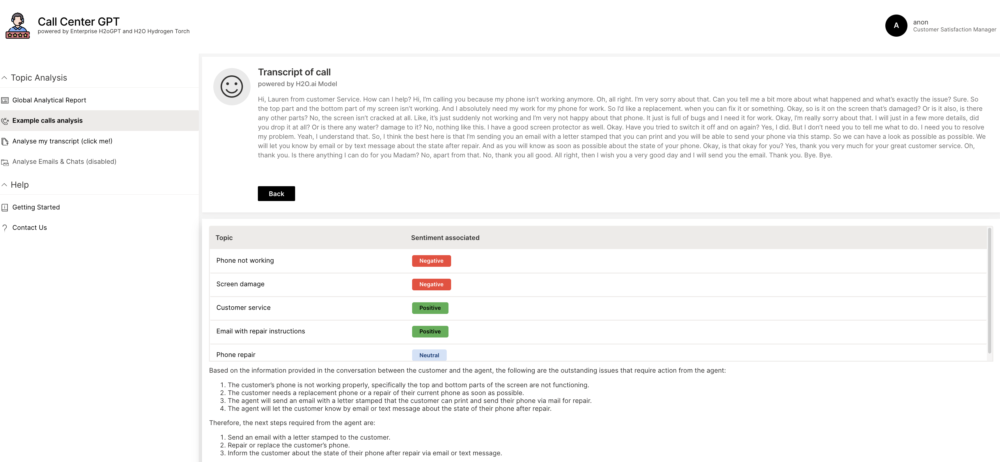

## App Description: 

**Audience:**  Call Center Team and Manager



## Deploy in the AI Cloud

### Secrets

```
h2o secret create callcenterapp -l h2ogpte-api-token="***************************************" -l h2ogpte-url="https://********.h2ogpte.h2o.ai"
```
or to update:
```
h2o secret update callcenterapp -l h2ogpte-api-token="*******************" -l h2ogpte-url="https://****.h2ogpte.h2o.ai" `
```
### Config

the `h2ogpte_config` dictionary in `src/config.py` can be modified to update  H2oGPT prompts, LLM parameters or LLM models

### Install and use / develop the app locally
*The app has been tested with wave 0.26.3*

Download wave from: https://github.com/h2oai/wave/releases/tag/v0.26.3 or use the below code in Linux.

`wget https://github.com/h2oai/wave/releases/download/v0.26.3/wave-0.26.3-linux-amd64.tar.gz`

Unzip the file and run wave as it is described in: https://wave.h2o.ai/docs/installation

### Install the app

Create and activate a conda environment or a virtual environment. 

For example with conda:

`conda create -n wave_env python=3.9`

`conda activate wave_env`

Enter the app directory.

`cd CallCenterGPT`

When run locally to debug (default is INFO level logs)
```
export SET_LEVEL=DEBUG 
export H2O_WAVE_NO_LOG=true
```

Export the valid environment variables to use H2oGPT API
```
export H2OGPTE_URL="https://***********.h2ogpte.h2o.ai"

export H2OGPTE_API_TOKEN="***************************************"
```

Install the requirements.

`pip install -r requirements.txt`

### Use the app

Run the app (be sure that you in the app directory):

`wave run src/app.py`

Access it by visiting `http://localhost:10101/` or `http://<ip/server dns>:10101/`