# H2O GenAI App Store
Welcome to the H2O.ai GenAI Apps Open Source Repository!

Here, we present a collection of GenAI applications developed by H2O.ai and the community, each residing in its dedicated folder. These apps harness the power of H2O Wave, H2OGPT, and H2OGPTE and are tailored to address distinct use cases. Whether you want to explore the capabilities of Retrieval Augmented Generation (RAG), create custom System Prompts, design personalized User Interfaces, or delve into more exciting features, you've come to the right place.

Try the apps and discover their potential by visiting https://genai.h2o.ai. You can create a free account to use any of the apps firsthand. Feeling inspired to contribute or build your own GenAI app? We welcome your Pull Requests (PRs); you can use existing apps as templates or make something brand new!

## Meet the Apps

### Ask H2O
The **Ask H2O** app is a custom UI on top of H2O Documentation and LLMs for a special use case.
Using Retrieval Augmented Generation, users can ask questions and get contextualized answers from public H2O documentation.

Use this app for a template of any RAG-based chat on top of Enterprise H2OGPTE.
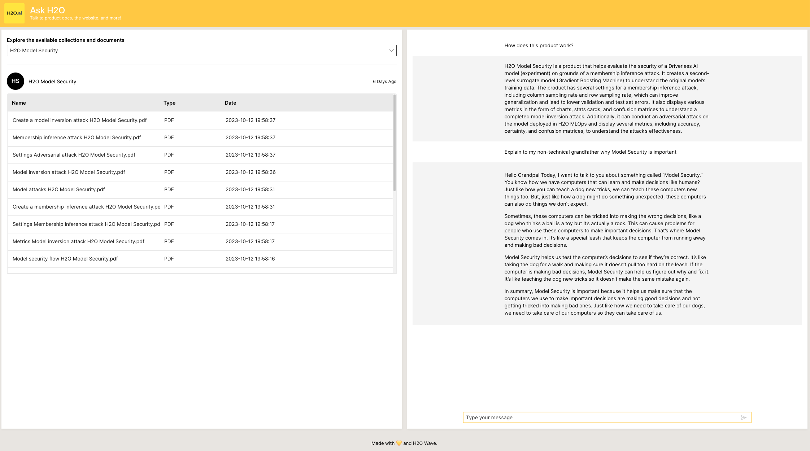

### Brazilian Law GPT
**BrLawGPT** is a tool designed to speed up the study and interpretation of legal documents, specifically initial petitions of Brazilian legal system. With this application, you can easily interact with PDF documents, extract valuable information, and improve productivity across multiple use cases.

Use this app for a template of any RAG-based chat with user-imported documents on top of Enterprise H2OGPTE.

### Company Financial Overview
The **Company Financial Overview App** queries a Llama2 model hosted by H2OGPT for information about any public company including. 

Use this app for a template of parallelizing multiple requests to a large language model and display the information nicely for users. 

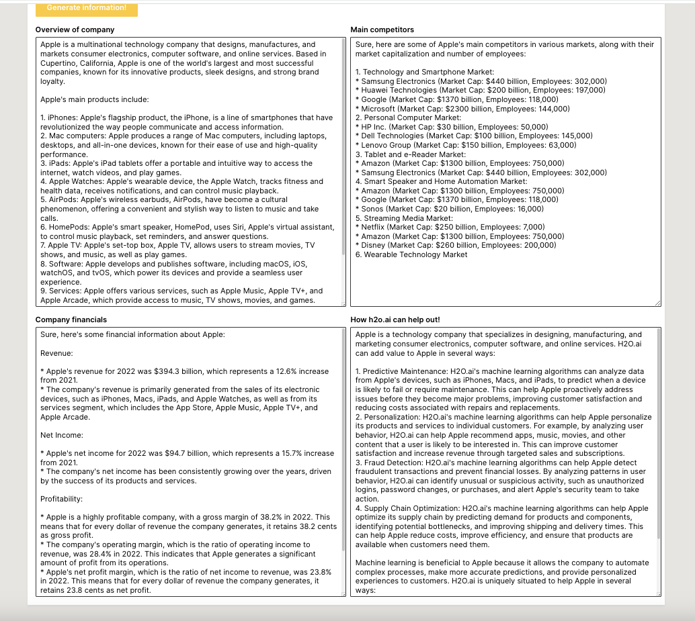

### Cycling Training Plan

The **Cycling Training Plan App**  helps you get into cycling with the benefits of getting fit and riding faster! Create your own, personalized plan to meet your goals. 

Use this app for a template of helping users create their own prompt in the constrains of a specific use case.

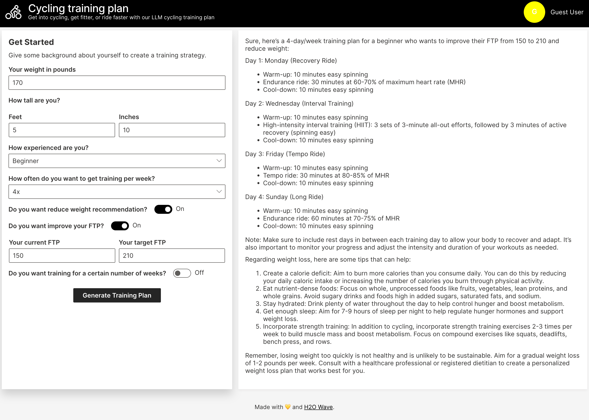

### Financial Reseach

The **Financial Research App** allows you to chat with specific compan SEC 10ks for investment research, allowing the user to quickly extract meaningful information regarding potential risk positions and investment opportunities.

Use this app for a template of any RAG-based chat on top of Enterprise H2OGPTE.

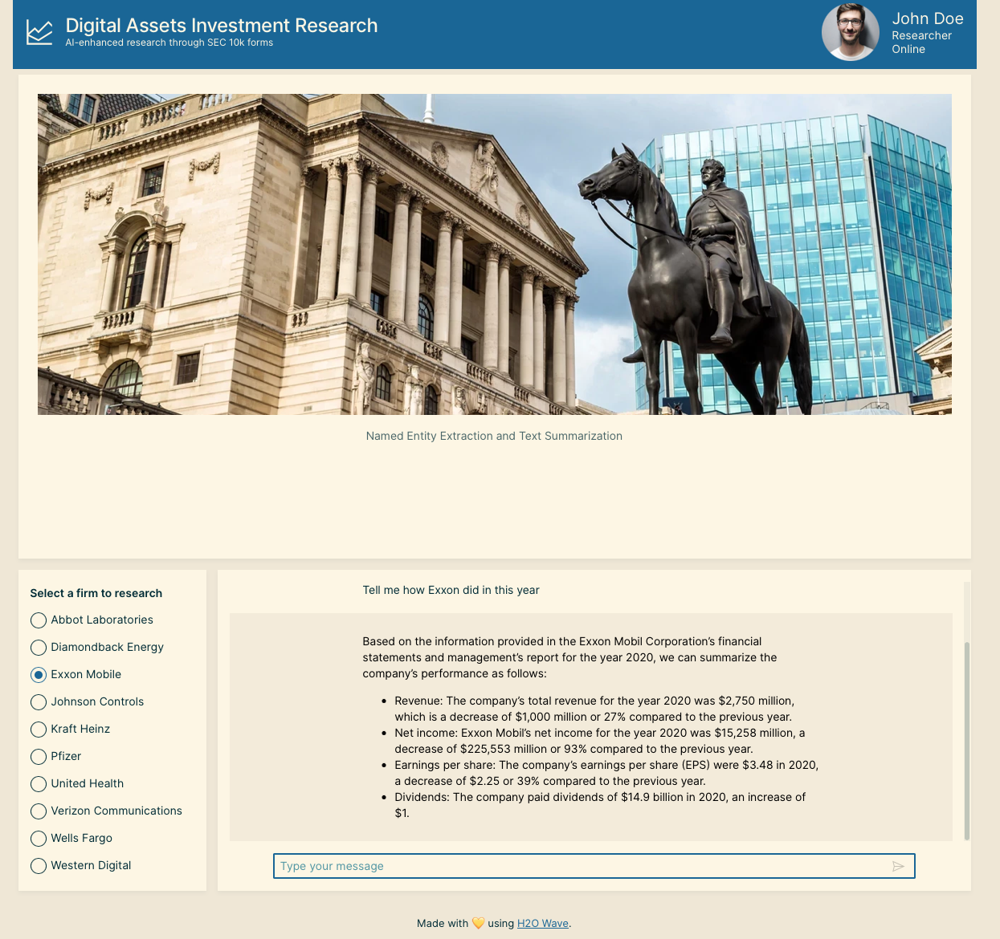

### Grammar and Syntax Review
The **Content Review App** allows users to ensure consistency in their content by having an LLM review content for specific brand rules like "always use an oxford comma".

Use this app for a template for customizing user and system prompts.

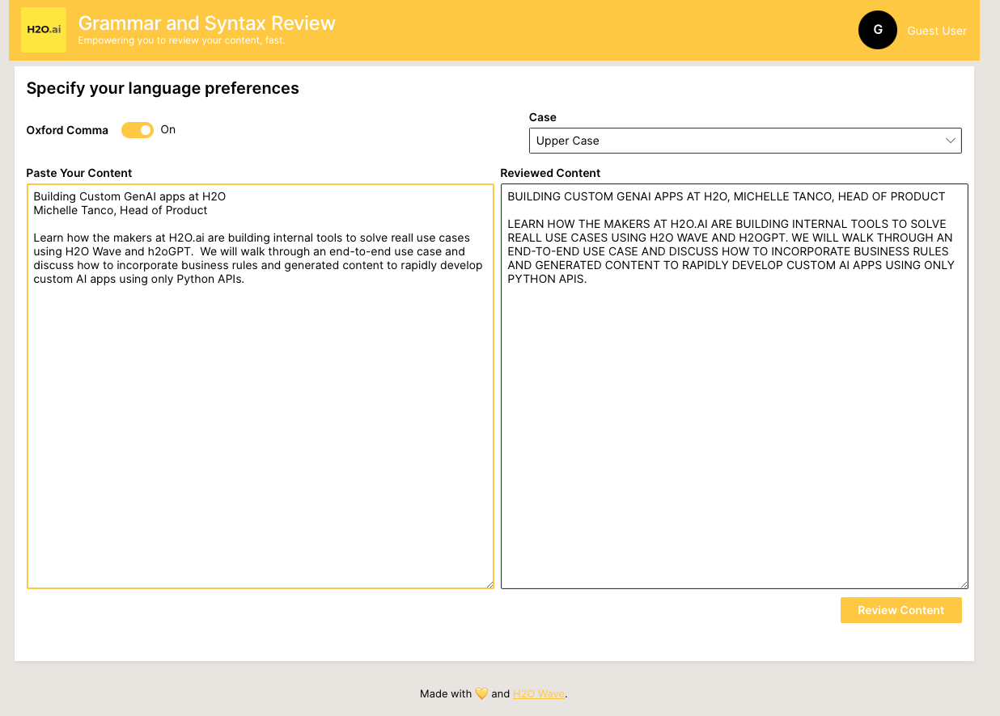

### Home Listings
Use the **Home Listings** app for help customizing LLM prompts to help you create the perfect home listing for your target audience. 

Use this as a template for helping users customize prompts.

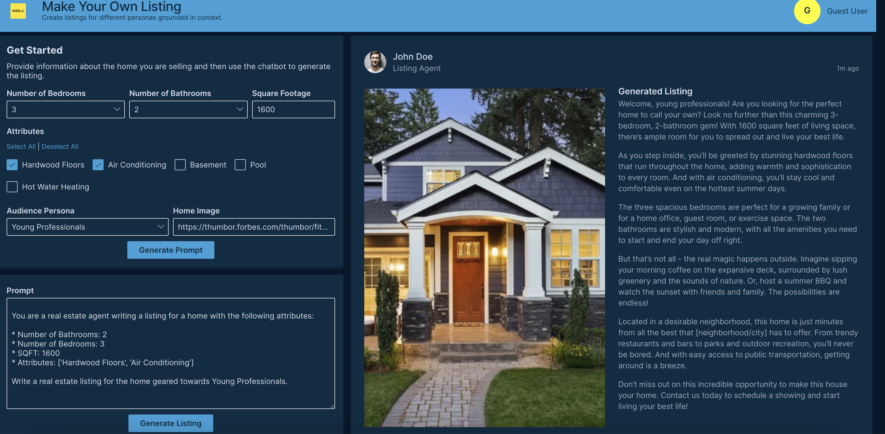

### Python Code Inspector
Use the **Clean Code App** to get help writing amazing and easy to follow python code. Try this out on your own AI Apps!

Use this as a template for custom prompts that help end users learn a skill better. 

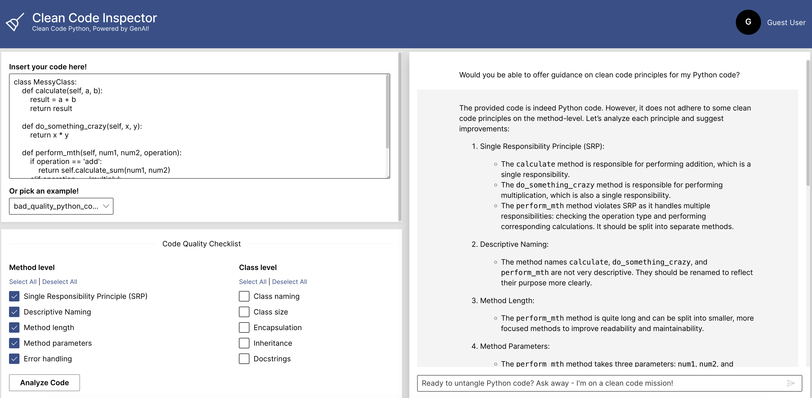

### RFI Assistant
Use the **RFI Assistant app** to make Requests for Information (RFI) less painful!

Use this as a template for users to interact with exisiting documents in H2OGPTE.

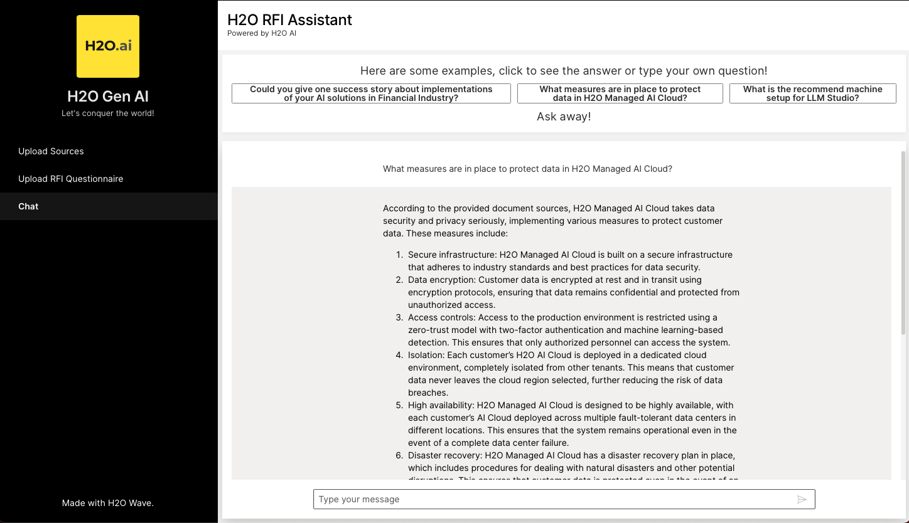

### Study Partner

**Study Partner** identifies topics in a collection of documents and then quizes you with multiple choice and open ended questions on the topic. Get immeadiate feedback on your answers to learn a new topic fast.

Use this as a template for users to learn about any topic.

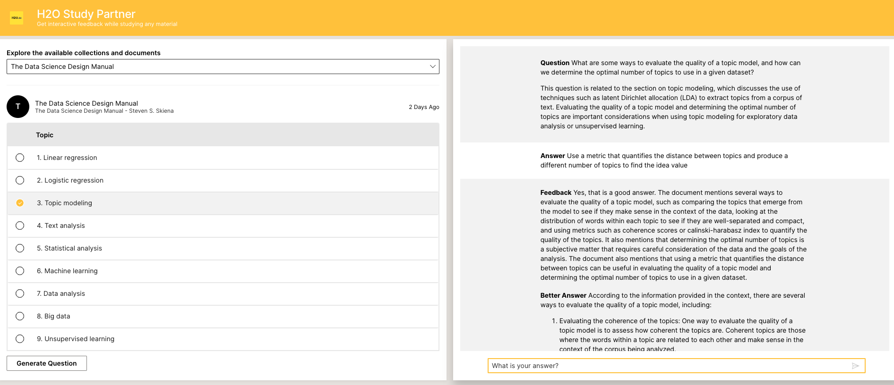

### TomatoAI

Grow your own vegetables with the poser of Generative AI.

Use this template for any use case where you want to customize prompts for users or allow for open ended questions.

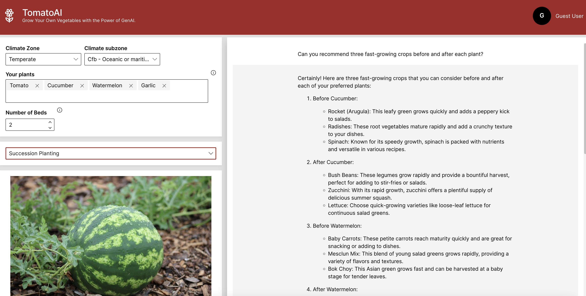

### Transcribe and Summarize

Combine the power of Whisper and H2O to transcribe, summarize, and extract sentiment from audio files.

Use this template for a straightforward UI of file input, GenAI output.

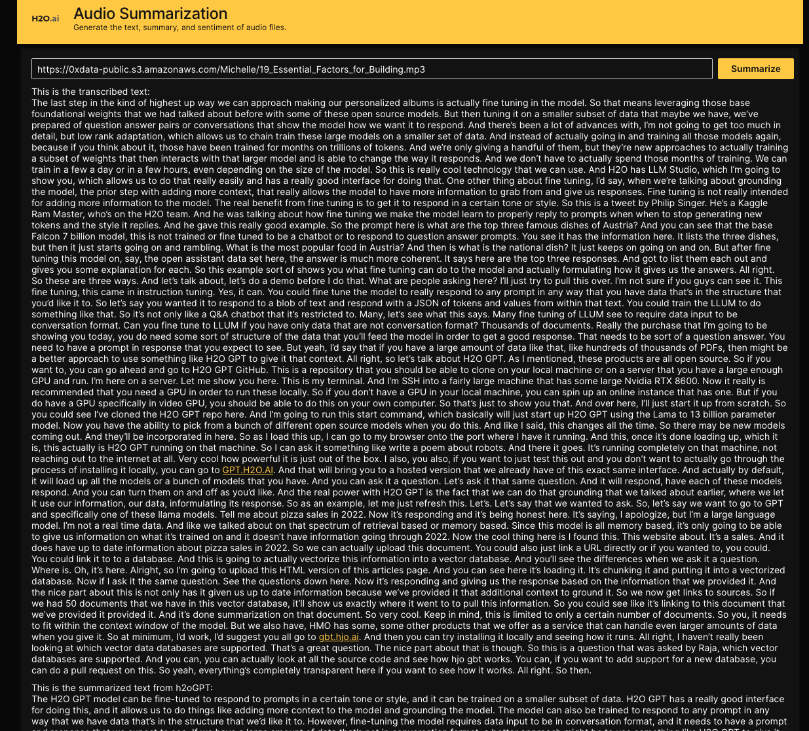

### Weekly Meal Planning

Answer basic questions about your family's eating habits to quickly generate a meal plan for the week, with optional cooking instructions. 

Use this template for helping user's customize LLM prompts.
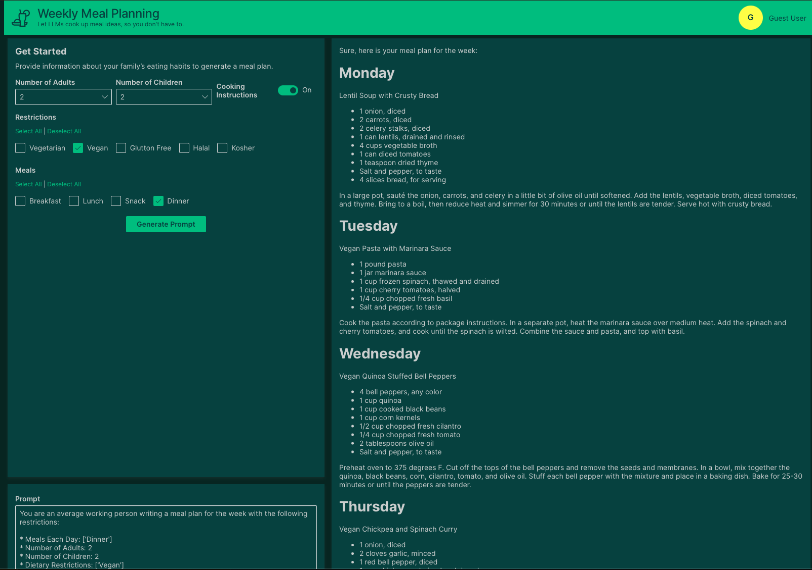
