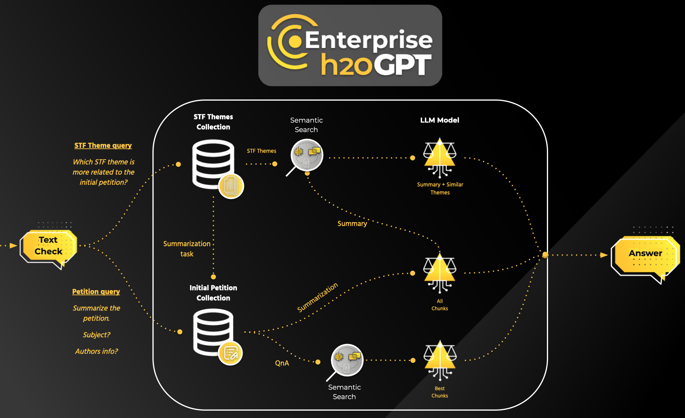
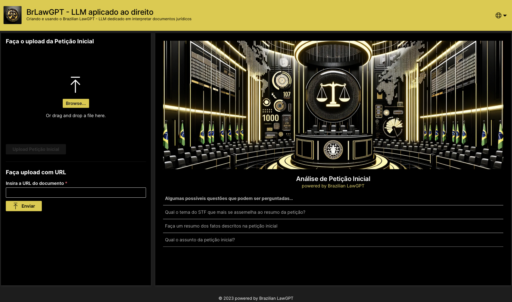
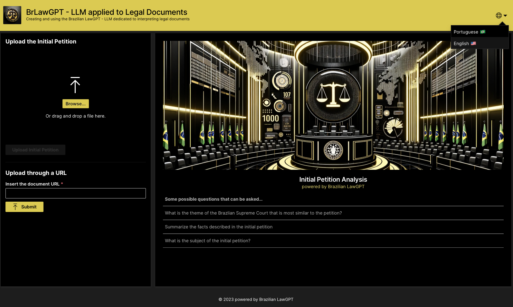

# BrLawGPT
Powered by h2oGPTe

## About this app:

This application is a tool designed to speed up the study and interpretation of legal documents, specifically initial petitions of Brazilian legal system. With this application, you can easily interact with PDF documents, extract valuable information, and improve productivity across multiple use cases.

### Main features
The application can automatically perform 3 types of interaction functions with the initial petition:
- Chat with petitions to discover specific information
- Summarize initial petitions
- Search among more than 900 precedent themes of the Supreme Court which is most related to the subject of the petition

### How it works? Search for Supreme Court precedent themes


### Choose between PT-BR or EN-US
The app will translate the questions and answers automatically 

PT-BR 🇧🇷


EN-US 🇺🇸



## Local Development
```shell script
python3.8 -m venv venv
./venv/bin/pip install -r requirements.txt
./venv/bin/wave run src/app.py
```

export H2OGPTE_API_TOKEN=""
export H2OGPTE_URL="https://**.h2ogpte.h2o.ai"

export PRIMARY_COLOR="#FEC925"
export SECONDARY_COLOR="#E8E5E1"
export LOGO="https://h2o.ai/content/experience-fragments/h2o/us/en/site/header/master/_jcr_content/root/container/header_copy/logo.coreimg.svg/1696007565253/h2o-logo.svg"

## Deploy in the AI Cloud

### Secrets
```
h2o secret create company-information-at-a-glance -l h2ogpte-key="" -l h2ogpte-url="https://***.h2ogpte.h2o.ai"
```