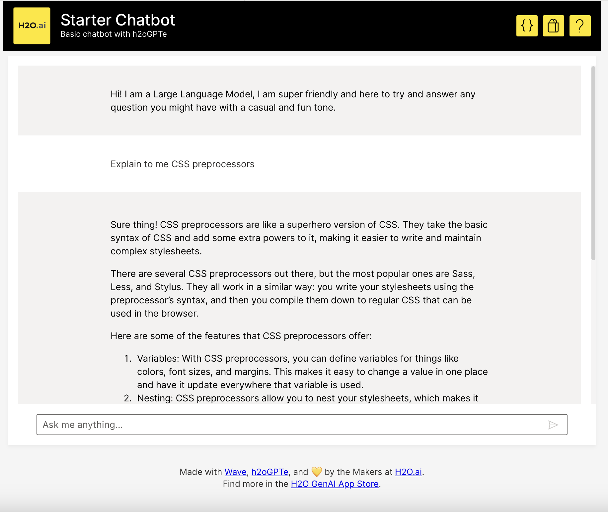

# Wave Chatbot

This template H2O Wave App is your starting point for chatbots on top of h2oGPTe. Easily customize the Prompts, 
LLMs, and Look and Feel of this app to make your own Chatbots. 




## Features
1. Interact with an LLM using the h2oGPTe API
2. Easily parameterize the System Prompt and LLM in your app code
3. Stream the response for improved UX
4. Provide sample questions to help users get started
5. Gracefully handle authentication and API errors
6. Support for mobile and desktop

## Developing

### Prerequisites
* Python 3.7+ 
* Pip (Python package installer)
* Virtualenv (optional but recommended)

### Installation
1. Clone the repository:
    ```shell script
    git clone https://github.com/h2oai/genai-app-store-apps
    ```

2. Navigate to this app's directory:
    ```shell script
    cd genai-app-store-apps/template-chatbot
    ```
   
3. Create a virtual environment (optional but recommended):
    ```shell script
    python -m venv venv
    ```
4. Activate the virtual environment:
    * On Windows:
    ```shell script
    venv\Scripts\activate
    ```
    * On Unix or MacOS:
    ```shell script
    source venv/bin/activate
    ```
5. Install the required dependencies:
   ```shell script
    pip install -r requirements.txt
    ```

6. Get an H2OGPTE License Key:
    * Navigate to the [H2OGPTE Free Trial](https://h2ogpte.genai.h2o.ai), or your own 
    H2OGPTE Environment
    * Click `API` from the left side-panel
    * Create and save a new API Key
    * Set the variables in your local environment 
    
        * On Unix or MacOS:
        ```shell script
        export H2OGPTE_URL="https://h2ogpte.genai.h2o.ai"
        export H2OGPTE_API_TOKEN="***"
        ```
        * On Windows:
        ```
        $env:H2OGPTE_URL='https://h2ogpte.genai.h2o.ai/'
        $env:H2OGPTE_API_TOKEN='***'
        ```
   
### Usage

1. Run the application:
    ```
    wave run app.py
    ```
2. Open your web browser and navigate to http://localhost:10101 to access the chatbot.

## Deploy

Deploy your app in the H2O AI Cloud. Please note, users of the https://genai.h2o.ai 
Free Trial cannot deploy apps themselves today. Any contributions to this or a new app 
will be reviewed and deployed by the H2O.ai team.

1. Review the `app.toml` and use the h2o admin CLI or admin UI to create any 
necessary App Secrets

2. Import the app and make the visibility Public

3. Run an instance with the ALL_USERS visibility

4. Assign the Alias to the new instance or create and assign an Alias

5. Pause and delete the only instance

6. Delete the old app version

## Contributing
Contributing to this project is welcome! You can open a PR with suggested changes or 
improvements to this specific app, or create your own GenAI app using this one as a 
template.

## Acknowledgments

Special thanks to the developers of 
[H2OGPTE](https://h2o.ai/platform/enterprise-h2ogpte/) for creating RAG capabilities 
and [H2O Wave](https://wave.h2o.ai) for the ability to rapidly develop web apps using 
only Python.
